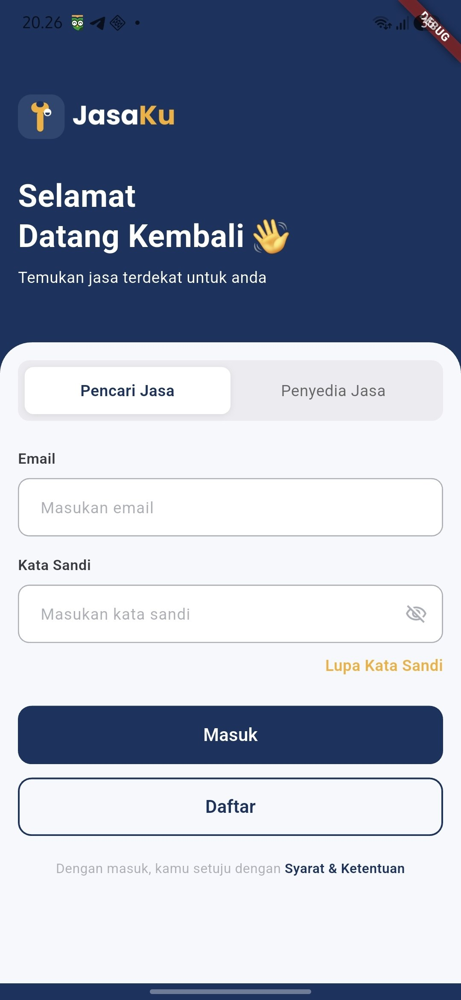
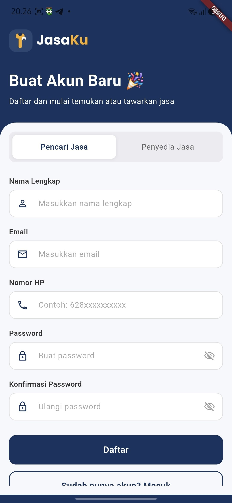
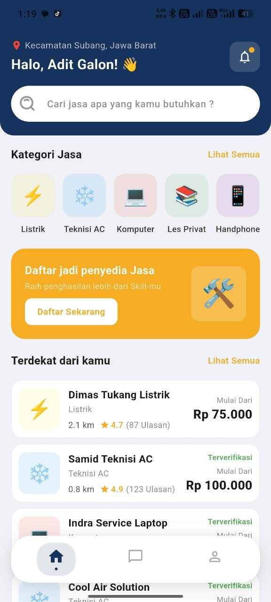
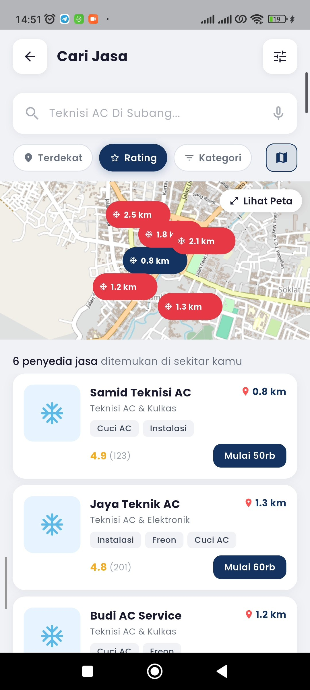
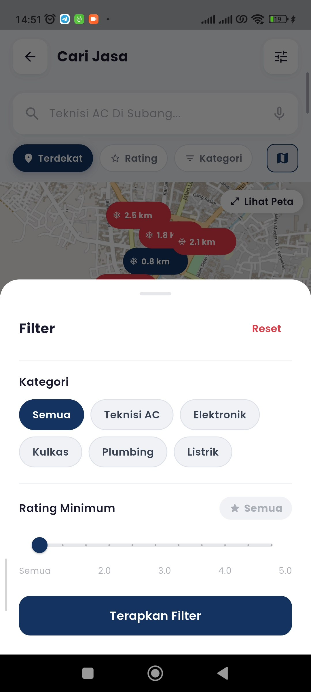
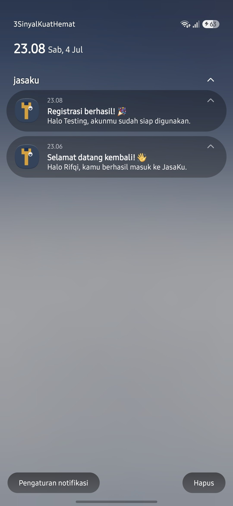
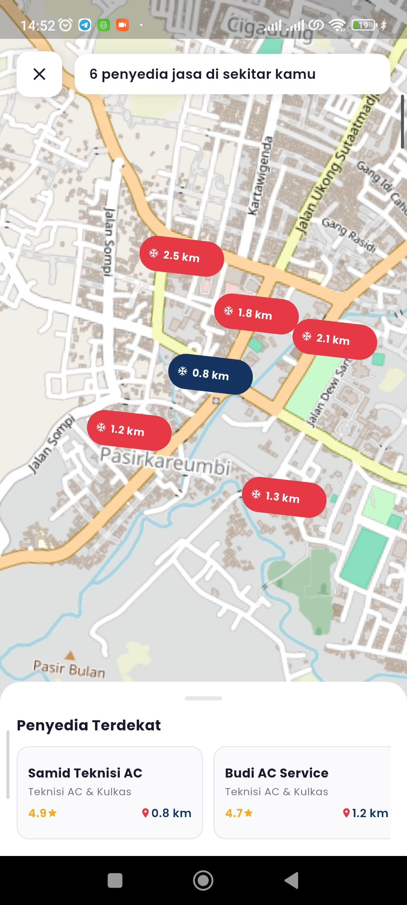

# JasaKu 🛠️

**JasaKu** adalah aplikasi marketplace jasa lokal berbasis mobile yang menghubungkan pengguna dengan penyedia jasa di sekitar mereka — mulai dari tukang, cleaning service, hingga jasa profesional lainnya.

---

## 📥 Download Aplikasi

> _[Download APK JasaKu](https://drive.google.com/file/d/1Ra6LUsmUe1qOfpHZ1bIBbO9ApYIwl6gD/view?usp=sharing)_

---

## 📱 UI Design

> _Figma Design: [JasaKu – UI/UX Design](https://www.figma.com/design/ZPWFsK1NVMdgW8QPrkgQ7e/JasaKu?node-id=0-1&t=IWBUG7qh9EnkGNLV-1)_

---

## 📘 API Documentation
 
> _Swagger API: [JasaKu API Docs](https://jasaku-api.rifqiikhsan.my.id/api)_
 
---

## 🚀 Tech Stack

| Layer | Teknologi |
|---|---|
| Framework | Flutter 3.44.0 (Dart 3.12.0) |
| State Management | Riverpod (`flutter_riverpod`) |
| Navigation | go_router |
| HTTP Client | Dio |
| Local Storage | flutter_secure_storage |
| Lokasi & Geocoding | geolocator, geocoding |
| Notifikasi | flutter_local_notifications |
| Arsitektur | Clean Architecture (feature-first: data / domain / presentation) |

---

## 🏗️ Software Architecture

Project ini menerapkan **Clean Architecture** dengan pemisahan layer per fitur:

```
features/<nama_fitur>/
├── data/
│   ├── datasources/     # Sumber data (remote API)
│   ├── models/          # Model request & response
│   └── repositories/    # Implementasi repository
├── domain/
│   ├── entities/         # Entity murni (business object)
│   ├── repositories/     # Kontrak/interface repository
│   └── usecases/         # Logic use case per aksi
└── presentation/
    ├── providers/         # State management (Riverpod)
    ├── screens/           # Halaman/screen
    └── widgets/           # Widget pendukung screen
```

Pemisahan ini memastikan **Separation of Concerns** — logic bisnis (domain), sumber data (data), dan tampilan (presentation) tidak saling bercampur, sehingga project lebih mudah diuji dan dikembangkan.

---

## 🏗️ Struktur Folder

```
lib/
├── app/
│   ├── router.dart                 # Konfigurasi go_router + auth guard
│   └── theme.dart                  # App theme & warna
│
├── core/
│   ├── services/
│   │   ├── location_service.dart       # Permission lokasi + reverse geocoding
│   │   └── notification_service.dart   # Local notification
│   ├── providers/
│   │   └── location_provider.dart      # State lokasi (koordinat, kota, provinsi)
│   └── storage/
│       └── secure_storage.dart         # Wrapper flutter_secure_storage
│
├── features/
│   ├── auth/
│   │   ├── data/
│   │   │   ├── datasources/
│   │   │   ├── models/
│   │   │   └── repositories/
│   │   ├── domain/
│   │   │   ├── entities/
│   │   │   ├── repositories/
│   │   │   └── usecases/
│   │   └── presentation/
│   │       ├── providers/
│   │       │   ├── login_provider.dart
│   │       │   ├── logout_provider.dart
│   │       │   └── auth_state_provider.dart
│   │       ├── screens/
│   │       │   ├── login_screen.dart
│   │       │   └── register_screen.dart
│   │       └── widgets/
│   │           ├── login_footer.dart
│   │           ├── login_form.dart
│   │           └── role_selector.dart
│   │
│   ├── home/
│   │   └── presentation/
│   │       ├── providers/
│   │       │   ├── home_provider.dart
│   │       │   ├── category_provider.dart
│   │       │   └── service_provider.dart
│   │       ├── screen/
│   │       │   ├── home_switcher_screen.dart   # Redirect otomatis sesuai role
│   │       │   ├── home_customer_screen.dart
│   │       │   └── home_provider_screen.dart
│   │       └── widgets/
│   │           ├── home_header.dart
│   │           ├── banner_promo.dart
│   │           ├── category_section.dart
│   │           └── service_section.dart
│   │
│   ├── search/
│   │   └── presentation/
│   │       └── screen/
│   │           └── search_screen.dart
│   │
│   ├── profile/
│   │   └── presentation/
│   │       └── screen/
│   │           └── profile_screen.dart
│   │
│   └── chat/                       # (in progress)
│   └── splash/
│       └── splash_screen.dart
│
├── shared/
│   ├── enums/
│   │   └── user_role.dart
│   └── widgets/
│       ├── app_button.dart
│       ├── app_search_bar.dart
│       ├── app_text_field.dart
│       ├── floating_bottom_nav_bar.dart
│       └── main_shell.dart         # Shell route wrapper (bottom nav)
│
└── main.dart
```

---

## ✨ Fitur

| Fitur | Status |
|---|---|
| Login & Role Selector (Customer / Provider) | ✅ Done UI & API |
| Logout (clear session + local storage) | ✅ Done UI & API |
| Home Switcher (redirect otomatis sesuai role) | ✅ Done |
| Home Customer (kategori, banner promo, list jasa) | ✅ Done UI & API |
| Search Jasa | ✅ Done UI |
| Deteksi Lokasi (kota & provinsi otomatis) | ✅ Done |
| Local Notification (notifikasi login berhasil) | ✅ Done |
| Detail Jasa | 🚧 In Progress |
| Semua Kategori | 🚧 In Progress |
| Chat | 🚧 In Progress |
| Edit Profile | 🚧 In Progress |

---

## 🔗 Integrasi REST API

Aplikasi mengambil data dari REST API untuk:
- **Autentikasi** (login) — mengirim kredensial dan role, menerima token akses beserta data user.
- **Kategori & Daftar Jasa** — menampilkan list data kategori dan layanan yang tersedia di halaman Home, sesuai role pengguna yang login.

Komunikasi API menggunakan **Dio** sebagai HTTP client, dengan pemisahan lapisan `datasource` (pemanggilan API mentah) dan `repository` (pemetaan response ke entity domain) mengikuti prinsip Clean Architecture.

---

## 🧠 State Management

Menggunakan **Riverpod** (`StateNotifierProvider` & `FutureProvider`) untuk mengelola:
- State autentikasi (`authStateProvider`) — status login/logout yang mempengaruhi navigasi routing secara reaktif.
- State form login (`loginProvider`) — role terpilih, input email/password, status loading & error.
- State halaman Home (`homeProvider`) — data kategori, daftar jasa, pencarian, dan status refresh.
- State lokasi (`locationProvider`) — koordinat, kota, dan provinsi pengguna secara real-time.

Provider di-`invalidate()` secara terkontrol saat login/logout untuk memastikan data selalu sinkron dengan sesi pengguna yang aktif, tanpa membawa cache dari sesi sebelumnya.

---

## 💾 Local Storage

Menggunakan **Flutter Secure Storage** (data terenkripsi) untuk menyimpan:
- Status login (access token & refresh token)
- Role pengguna aktif (Customer / Provider)
- Informasi profil (nama lengkap, ID pengguna)
- Lokasi terakhir (koordinat, kota, provinsi) sebagai cache agar bisa langsung ditampilkan tanpa menunggu GPS fresh

Seluruh data ini otomatis dibersihkan (`clearAll()`) saat pengguna logout.

---

## 📷 Mobile Feature

**Local Notification** — aplikasi menampilkan notifikasi lokal saat pengguna berhasil login, memberikan feedback instan kepada pengguna di luar tampilan UI biasa.

**Deteksi Lokasi** — aplikasi meminta izin akses lokasi pengguna, mengambil koordinat GPS, lalu melakukan reverse geocoding untuk menampilkan nama kota dan provinsi pengguna secara otomatis di halaman Home.

---

## 📸 Screenshot Aplikasi

| Login | Register | Home Customer |
|---|---|---|
|  |  |  |

| Search | Search Filter | Notifikasi |
|---|---|---|
|  |  |  |

| Show Maps |
|---|
|  |

---

## 🛠️ Setup & Instalasi

### Prasyarat

- Flutter `3.44.0` (channel stable)
- Dart `3.12.0`
- Android Studio / VS Code dengan Flutter & Dart plugin
- `compileSdk` minimal `36` (lihat konfigurasi di `android/app/build.gradle.kts`)

### Langkah Instalasi

1. **Clone repository**
   ```bash
   git clone https://github.com/rifqiikhsan/jasaku.git
   cd jasaku/Frontend
   ```

2. **Install dependencies**
   ```bash
   flutter pub get
   ```

3. **Jalankan aplikasi**
   ```bash
   flutter run
   ```

### Build Release

```bash
# Android APK
flutter build apk --release

# Android App Bundle
flutter build appbundle --release

# iOS
flutter build ios --release
```

---

## 📄 Lisensi

Proyek ini dibuat untuk keperluan akademik (Ujian Akhir Semester — Mobile Computing) dan pengembangan pribadi.

---

> Dibuat dengan ❤️ menggunakan Flutter 3.44.0